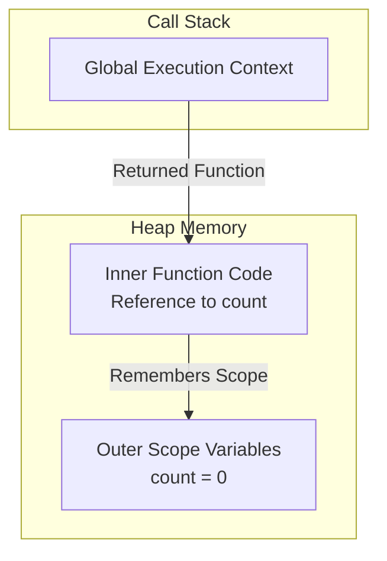

# Closures in JavaScript 🚀

If you have ever been in a JavaScript interview, you have probably heard the word **"Closure"** thrown around like it is some magical, complex wizardry. 

But guess what? It is actually a very simple and beautiful concept. Once you understand how JavaScript manages scope and execution contexts, closures will feel like second nature to you.

Let’s break it down step-by-step, using plain English and real-world examples.

---

## 1. The Simple Explanation (The "What")

In technical terms, a **closure** is created when a function is defined inside another function, allowing the inner function to access variables from the outer function's scope.

But let's make it simpler.

### The "Backpack" Analogy 🎒

Imagine you are going on a hike. Before you leave your house (the parent function), you pack some essential tools into your **backpack** (like a water bottle and a flashlight). 

Now, you leave your house and travel far away to a mountaintop (executing the inner function in a completely different scope). Even though you are no longer at home, you can still reach into your backpack and drink your water. 

In JavaScript, **every function carries a hidden backpack**. This backpack is called its **Lexical Environment**. Whenever a function is created, it packs up all the variables it has access to at that moment. No matter where that function is called later, it always keeps that backpack with it.

---

## 2. Under the Hood (The "Why")

To explain closures at a **placement level**, we must look at the **Execution Context** and the **Call Stack**.

Normally, when a function finishes running, its Execution Context is popped off the Call Stack, and all its local variables are deleted from memory (garbage-collected). 

**But closures break this rule!**

If an outer function returns an inner function, the inner function holds a reference to the outer function’s variables. Because of this reference, JavaScript's garbage collector says: *"Wait, someone is still using those outer variables! I cannot delete them yet."*

As a result, those outer variables are kept alive in memory.

### Visualizing Closures with a Diagram 🗺️

Here is how JavaScript keeps variables alive behind the scenes:



---

## 3. Step-by-Step Code Walkthrough

Let’s look at a classic closure in action:

```javascript
function createCounter() {
    let count = 0; // 1. "count" is defined in the outer scope

    function increment() {
        count++; // 2. Inner function accesses "count"
        console.log(count);
    }

    return increment; // 3. We return the inner function
}

const myCounter = createCounter(); // 4. "createCounter" runs and returns "increment"

myCounter(); // Output: 1
myCounter(); // Output: 2
```

### Let's trace this line-by-line:

1. We call `createCounter()`. A new Function Execution Context is created, and the variable `count` is initialized to `0`.
2. `createCounter()` returns the `increment` function and finishes running. Its execution context is popped off the Call Stack. **Normally, `count` should die here.**
3. But we assigned the returned `increment` function to `myCounter`.
4. When we call `myCounter()`, it runs the code `count++`. JavaScript looks inside `increment`'s local scope. It doesn't find `count` there.
5. Thanks to the **closure (the backpack)**, JavaScript looks in the remembered outer scope, finds `count`, increments it to `1`, and prints it.
6. The next time we call `myCounter()`, it increments the *same* remembered `count` to `2`.

---

## 4. Practical Use Cases (Why do we care?)

Closures aren't just an interview topic—they are incredibly useful in daily coding. Here are the three most common use cases:

### A. Data Encapsulation & Private Variables 🔒
In JavaScript, classes have private fields, but historically, closures were the main way to hide variables from the outside world. This prevents external code from accidentally breaking your state.

```javascript
function createBankAccount(initialBalance) {
    let balance = initialBalance; // Private variable

    return {
        deposit: function(amount) {
            balance += amount;
            console.log(`Deposited: $${amount}. Balance: $${balance}`);
        },
        withdraw: function(amount) {
            if (amount > balance) {
                console.log("Insufficient funds!");
                return;
            }
            balance -= amount;
            console.log(`Withdrew: $${amount}. Balance: $${balance}`);
        },
        getBalance: function() {
            return balance; // Only way to view the balance
        }
    };
}

const myAccount = createBankAccount(100);
myAccount.deposit(50);      // Deposited: $50. Balance: $150
myAccount.withdraw(30);     // Withdrew: $30. Balance: $120
console.log(myAccount.balance); // undefined (Safe! Can't access directly)
console.log(myAccount.getBalance()); // 120
```

### B. Function Factories (Currying) 🏭
You can use closures to create specialized versions of functions.

```javascript
function makeMultiplier(multiplier) {
    return function(num) {
        return num * multiplier; // Remembers "multiplier"
    };
}

const double = makeMultiplier(2);
const triple = makeMultiplier(3);

console.log(double(5)); // 10
console.log(triple(5)); // 15
```

### C. Maintaining State in Asynchronous Callbacks ⏱️
Closures allow event listeners or timers to remember values they need, even when executed seconds or minutes later.

```javascript
function setupButton(buttonId, message) {
    const button = document.getElementById(buttonId);
    
    // The event handler is a closure that remembers "message"
    button.addEventListener("click", function() {
        alert(message);
    });
}
```

---

## 5. The Infamous Interview Question: Loops + `setTimeout`

This is hands-down the most popular closure question in frontend interviews.

### The Problem
What will this code print?

```javascript
for (var i = 1; i <= 5; i++) {
    setTimeout(function() {
        console.log(i);
    }, i * 1000);
}
```

**Common Guess:** `1, 2, 3, 4, 5`  
**Actual Output:** `6, 6, 6, 6, 6` (printed with a 1-second delay between each)

#### Why does this happen?
1. `var` is **function-scoped**, not block-scoped. There is only **one shared copy** of `i` in memory for the entire loop.
2. The loop runs extremely fast. It finishes and leaves `i = 6` in memory before any of the `setTimeout` callbacks run.
3. When the callbacks finally trigger after 1, 2, 3, 4, and 5 seconds, they all reach into the scope, look at the *same shared variable* `i`, and print `6`.

---

### Solution 1: Use `let` (Modern & Simple) 💡

If you change `var` to `let`, it works perfectly!

```javascript
for (let i = 1; i <= 5; i++) {
    setTimeout(function() {
        console.log(i);
    }, i * 1000);
}
```

**Output:** `1, 2, 3, 4, 5`

**Why?**  
`let` is **block-scoped**. Every single iteration of the loop creates a **brand new scope** with its own distinct copy of `i`. Each `setTimeout` callback creates a closure over its *own* specific copy of `i`.

---

### Solution 2: Use an IIFE (If you can't use `let`) 🏛️

If an interviewer asks you to solve it *without* using `let`, you can use an **Immediately Invoked Function Expression (IIFE)** to force a closure:

```javascript
for (var i = 1; i <= 5; i++) {
    (function(currentNum) {
        setTimeout(function() {
            console.log(currentNum);
        }, currentNum * 1000);
    })(i); // Pass the current value of i into the IIFE
}
```

**Output:** `1, 2, 3, 4, 5`

**Why?**  
By wrapping `setTimeout` inside a function and immediately invoking it with `i`, we copy the value of `i` into `currentNum`. Since `currentNum` is a parameter of the IIFE, it is locally scoped to that block, creating a unique closure for each timer.

---

## 6. The Trade-offs: Memory & Clean Up 🧹

While closures are incredibly powerful, they come with a warning label:

> [!WARNING]
> **Closures can lead to Memory Leaks if not managed carefully!**

Because variables inside a closure cannot be garbage-collected as long as the inner function is alive, they consume RAM. If you create thousands of closures and never clean them up, your app can slow down or crash.

### How to clean them up?
When you are done using a closure, you should manually break the reference by setting the variable holding the function to `null`.

```javascript
let mySecretCounter = createCounter();

// Use it...
mySecretCounter(); 

// Clean it up when no longer needed
mySecretCounter = null; // The garbage collector can now free the memory!
```

---

## 7. Placement-Level Interview Questions

### Q1: What is a closure in JavaScript?
**Answer:** A closure is the combination of a function bundled together with references to its surrounding state (the lexical environment). In simple terms, a closure gives an inner function access to the outer function's variables even after the outer function has returned.

---

### Q2: What is the Lexical Environment?
**Answer:** The lexical environment is the physical placement of variables and blocks in your code. It consists of the local environment (variables defined in the current block) and a reference to the outer environment (parent scopes).

---

### Q3: Predict the output:
```javascript
function outer() {
    let x = 10;
    return function inner() {
        x++;
        console.log(x);
    };
}
const test1 = outer();
const test2 = outer();

test1(); 
test1(); 
test2(); 
```

**Answer:**
```text
11
12
11
```
**Explanation:**  
Each call to `outer()` creates a **completely fresh execution context and closure scope**. `test1` and `test2` point to separate closures, meaning they maintain separate counters.

---

### Q4: How do you make a variable private in JavaScript?
**Answer:** By declaring it inside a parent function and returning an inner function (or object containing methods) that references that variable. Since the variable is scoped locally to the parent, it cannot be accessed directly from outside the returned inner functions.

---

### Q5: What is the output of the following code?
```javascript
let a = 1;
function parent() {
    let a = 2;
    function child() {
        console.log(a);
    }
    return child;
}
let aRef = parent();
a = 10;
aRef();
```

**Answer:**
```text
2
```
**Explanation:**  
The `child` function forms a closure over `parent`'s scope. The closest variable `a` in its scope chain is the one defined in `parent` (`a = 2`). The global variable modification `a = 10` does not affect this because lexical scope looks at where the function was written, not where it was executed.

---

### Q6: Can you write a function `once(fn)` that ensures a given function can only be called once?
**Answer:** Yes! We can use closures to track whether the function has already been executed.

```javascript
function once(fn) {
    let called = false;
    let result;

    return function(...args) {
        if (!called) {
            called = true;
            result = fn(...args);
        }
        return result;
    };
}

const launchRocket = once(() => "Rocket Launched! 🚀");
console.log(launchRocket()); // "Rocket Launched! 🚀"
console.log(launchRocket()); // "Rocket Launched! 🚀" (Does not launch again)
```

---

## Quick Summary Table

| Feature | Details |
| :--- | :--- |
| **Core Concept** | Inner function remembers and accesses outer scope variables. |
| **Trigger** | Returning an inner function or passing it as a callback. |
| **Memory Behavior** | Prevents outer scope variables from being garbage-collected. |
| **Top Use Case** | Data encapsulation, currying, and maintaining state. |
| **Main Drawback** | Potential memory leaks if closures are kept indefinitely. |

---

## Next Topic
Now that you have mastered Closures, you are ready to understand the next pillar of JavaScript execution:
> **Prototypes and Prototype Chain ⛓️**  
> *Check out the next guide in the series to master OOP in JavaScript!*
