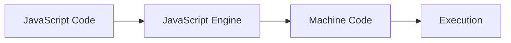

# JavaScript

## Definition
**JavaScript** is a high-level, interpreted, single-threaded, dynamically typed, prototype-based, event-driven programming language used to build interactive and dynamic web applications.

---

## 1. High-Level Language

### Meaning
A high-level language is designed to be easy for humans to read and write. You do **NOT** need to manage low-level system resources such as:
- Memory allocation
- CPU registers
- Hardware details

> *JavaScript handles these automatically.*

### Example
```javascript
let x = 10;
let y = 20;
let sum = x + y;
```
*This is simple and readable compared to low-level languages.*

### Industry Perspective
Being a high-level language means:
- **Faster development**
- **Easier debugging**
- **Less complexity**

**Common Uses:**
- Frontend development
- Backend development
- Full stack applications

---

## 2. Interpreted Language

### Meaning
JavaScript runs code line-by-line using a JavaScript engine. It does **NOT** need compilation like C++.

**Browser Engines:**
- Chrome → **V8 Engine**
- Firefox → **SpiderMonkey**

### How it works internally
**Example:**
```javascript
console.log("Hello");
```
*Engine reads → executes → shows output.*  
*No separate compilation step is required.*

> **Interview Point:** JavaScript is interpreted, but modern engines use **JIT (Just-In-Time compilation)** for performance.

---

## 3. Single-Threaded Language
> ⚠️ **VERY IMPORTANT for placements.**

### Meaning
JavaScript executes **one task at a time**. It has only **ONE** call stack.

### Example
```javascript
console.log("Task 1");
console.log("Task 2");
console.log("Task 3");
```
**Output:**
```
Task 1
Task 2
Task 3
```
*Runs sequentially, one by one.*

> **Real-Life Example:**  
> Imagine a **Railway Ticket Counter**.  
> Only one person can buy a ticket at a time. The next person must wait.  
> JavaScript works the same way.

### Interview Question
**Q: Is JavaScript single-threaded or multi-threaded?**  
**A:** Single-threaded.

---

## 4. Dynamically Typed Language

### Meaning
You do **NOT** need to specify the data type. JavaScript automatically detects the type.

### Example
```javascript
let x = 10;
x = "Vikash";
x = true;
```
*This is valid in JavaScript.*

**Comparison with C++:**
```cpp
int x = 10;
x = "Hello"; // Error
```

### Industry Advantage
- **Flexible** and **fast development**.

---

## 5. Prototype-Based Language
> *Advanced concept but important.*

### Meaning
JavaScript uses **prototypes** for inheritance, unlike Java which uses classes. Objects inherit from other objects using a prototype.

### Example
```javascript
function Person(name) {
    this.name = name;
}

Person.prototype.greet = function() {
    console.log("Hello " + this.name);
};

let p1 = new Person("Vikash");
p1.greet();
```
**Output:**
```
Hello Vikash
```

---

## 6. Event-Driven Language

### Meaning
JavaScript responds to events such as:
- `click`
- `input`
- `submit`
- `scroll`
- `mousemove`

### Example
```javascript
button.onclick = function() {
    console.log("Button clicked");
};
```
*When user clicks → code runs.*

> **Real Example:**  
> When you click **"Book Ticket"** on IRCTC, JavaScript handles the click event.

---

## 7. Interactive and Dynamic Web Applications

### Meaning
This is the main purpose of JavaScript.
- **Without JavaScript:** Website is static (Button does nothing).
- **With JavaScript:** Website is interactive (Button performs action).

### Example
```javascript
button.onclick = function() {
    alert("Payment Successful");
};
```

---

## 8. Where JavaScript Runs

### 1. Browser (Frontend)
- Form validation
- Button click handling
- UI updates
- **Example:** `document.getElementById("demo").innerHTML = "Hello";`

### 2. Server (Backend)
- Using **Node.js**
- Database handling
- Login authentication
- API creation
- **Example:** `const http = require("http");`

---

## 9. JavaScript Engine (Industry-Level Concept)

JavaScript runs inside a **JavaScript Engine** (e.g., V8 in Chrome/Node.js). The engine converts JavaScript into machine code.

### Internal Flow


---

## 10. Real Industry Example

**When you click "Add to Cart" on Amazon:**
1. JavaScript detects the **click**.
2. Updates the **cart count**.
3. Updates the **price**.
4. Shows a **notification**.
*All this happens without reloading the page.*

---

## 11. Placement-Level Definition
> **Best Answer for Interview:**  
> "JavaScript is a high-level, interpreted, single-threaded, dynamically typed, prototype-based, event-driven programming language used to build interactive and dynamic web applications. It runs inside JavaScript engines like V8 and is used for both frontend and backend development."

---

## 12. Important Interview Questions

1. **Why is JavaScript single-threaded?**
2. **What is a dynamically typed language?**
3. **What is an event-driven language?**
4. **What is a JavaScript engine?**
5. **Where does JavaScript run?**
